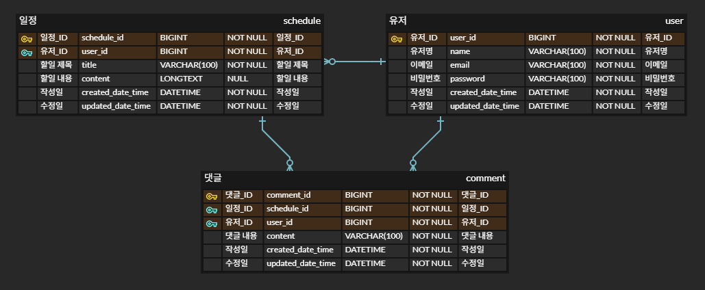
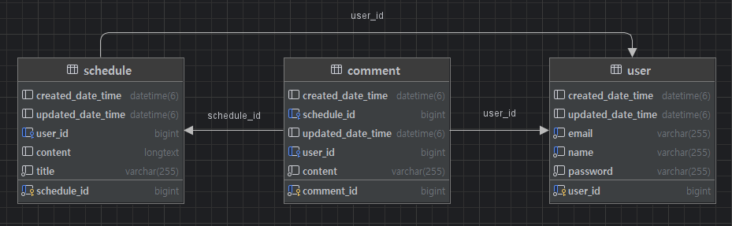

# 📅 schedule-app-dev
내일배움캠프 - 일정 관리 앱 Develop 과제

## 🐾 프로젝트 소개

schedule-app-dev은 CRUD 기반의 일정 관리 앱입니다.

기존의 schedule-app 보다 기능이 추가되며, JPA와 Cookie/Session를 활용합니다.

## 📌 주요 기능

각 레벨의 기능을 구현할 때마다 브랜치를 생성했습니다. 

`main` : 통합 <br/>
`challenge` : 필수과제와 도전과제(Lv 1 ~ Lv 8)의 기능<br/>
`essential` : 필수과제(Lv 1 ~ Lv 4)의 기능
- `Lv 1` : 일정 CRUD
- `Lv 2` : 유저 CRUD
- `Lv 3` : 회원가입
- `Lv 4` : 로그인(인증)
- `Lv 5` : 다양한 예외처리 적용하기 
- `Lv 6` : 비밀번호 암호화 
- `Lv 7` : 댓글 CRUD 
- `Lv 8` : 일정 페이징 조회

## 📑 API 명세서
아래 링크를 통해, **각 Method에 대한 요구사항 및 URL, Request, Response, 상태코드**를 확인할 수 있습니다.

[API 명세서 by postman](https://documenter.getpostman.com/view/44733463/2sB2qWG4BX)

## 🗂️ ERD





## ✅ 요구사항

### 1️⃣ 필수 기능 가이드

Lv 0. API 명세 및 ERD 작성
- [x] API 명세서 작성하기
- [x] ERD 작성하기
- [x] SQL 작성하기

Lv 1. 일정 CRUD
- [x] 일정을 생성, 조회, 수정, 삭제할 수 있습니다.
  - 생성 : 세션에서 유저 정보를 가져와, 생성한 일정과 연결합니다.
  - 조회 : 일정을 전체 조회와 선택 조회가 가능합니다.
  - 수정 : 본인이 작성한 일정을 수정합니다.
    - 세션에서 유저 정보를 가져와, 선택한 일정이 본인 것인지 확인합니다.
  - 삭제 : 본인이 작성한 일정을 삭제합니다.
    - 세션에서 유저 정보를 가져와, 선택한 일정이 본인 것인지 확인합니다.
    - 일정을 삭제하면 연결되어있는 댓글도 삭제됩니다.
 
Lv 2. 유저 CRUD / Lv 3. 회원가입
- [x] 유저를 생성, 조회, 수정, 삭제할 수 있습니다.
- [x] 유저에 비밀번호 필드를 추가합니다.
  - 생성 : 회원가입을 진행합니다.
    - 유저명과 이메일은 로그인 중복을 막기위해 유일합니다.
  - 조회 : 유저를 전체 조회와 선택 조회가 가능합니다.
  - 수정 : 본인의 비밀번호를 변경합니다.
    - 세션에서 유저 정보를 가져와, 기존의 비밀번호가 맞는지 확인합니다.
  - 삭제 : 회원탈퇴를 진행합니다.
    - 세션에서 유저 정보를 가져와, 비밀번호가 맞는지 확인합니다.
    - 유저 정보를 DB 에서 삭제한 후, 로그아웃을 진행합니다.
    - 유저를 삭제하면 본인이 작성한 일정과 댓글도 삭제됩니다.
  - 추가 기능
    - 로그인 : 이메일과 비밀번호로 유저를 찾고, 해당 정보를 세션에 저장합니다.
    - 로그아웃 : 세션에 존재한다면 로그아웃을 진행합니다.

Lv 4. 로그인(인증)
- [x] Cookie/Session을 활용해 로그인 기능을 구현합니다.
  - LoginFilter로 회원가입, 로그인, 로그아웃을 제외한 모든 요청에 로그인 확인 로직을 진행합니다.

### 2️⃣ 도전 기능 가이드
Lv 5. 다양한 예외처리 적용하기
- [x] `@Pattern`을 사용해서 회원 가입 Email 데이터 검증하기
  - User
    - userName : 영문자, 한글, 숫자만 사용하도록 정규식 사용 (1 ~ 10자)
    - userEmail : 이메일 형식에 맞는 정규식 사용
    - password : 영문자, 숫자, 특수문자를 각각 1번씩 사용하도록 정규식 사용 (4 ~ 20자)
  - Schedule 
    - title : max = 20
    - content : max = 500
  - Comment
    - content : max = 50

Lv 6. 비밀번호 암호화
- [x] 암호화를 위한 PasswordEncoder를 직접 만들어 사용합니다.
  - 비밀번호를 저장할 때 암호화를 사용합니다. (회원가입, 비밀번호 수정)
  - 비밀번호를 검증할 때 복호화를 사용합니다. (비밀번호 수정, 회원탈퇴)

Lv 7. 댓글 CRUD
- [x] 일정을 생성, 조회, 수정, 삭제할 수 있습니다.
  - 생성 : 세션에서 유저 정보를, 입력값의 일정 ID로 일정을 찾아, 생성한 댓글과 연결합니다.
  - 조회 : 댓글을 전체 조회와 선택 조회가 가능합니다.
    - 일정 ID로 특정 일정의 모든 댓글을 조회합니다.
    - 댓글 ID로 하나의 댓글을 조회합니다.
  - 수정 : 본인이 작성한 댓글을 수정합니다.
    - 세션에서 유저 정보를 가져와, 선택한 댓글이 본인 것인지 확인합니다.
  - 삭제 : 본인이 작성한 댓글을 삭제합니다.
    - 세션에서 유저 정보를 가져와, 선택한 댓글이 본인 것인지 확인합니다.

Lv 8. 일정 페이징 조회
- [x] 일정의 수정일을 기준으로 내림차순 정렬합니다.
- [x] 일정을 Spring Data JPA의 Pageable과 Page 인터페이스를 활용하여 페이지네이션을 구현합니다.
  - 페이징 정보를 생성합니다. `Pageable pageable = PageRequest.of(page, size);`
  - 메서드 명명 규칙을 활용하여 페이지네이션을 구현합니다.
- [x] 일정 조회 반환값에 `댓글 개수`를 포합합니다.
  - `countCommentBySchedule_Id`로 댓글 개수를 구한다.
  - 일정 반환 dto를 생성할 때 댓글 개수도 같이 전달한다.


## 📁 프로젝트 구조

```
schedule-app/
├── src/
│   ├── main/
│   │   ├── java/
│   │   │   └── com/example/scheduleapp/
│   │   │       ├── common/
│   │   │       │   └── Const.java
│   │   │       ├── config/
│   │   │       │   └── PasswordEncoder.java
│   │   │       │   └── WebConfig.java
│   │   │       ├── controller/
│   │   │       │   └── CommentController.java
│   │   │       │   └── ScheduleController.java
│   │   │       │   └── UserController.java
│   │   │       ├── dto/
│   │   │       │   ├── req/
│   │   │       │   └── res/
│   │   │       ├── entity/
│   │   │       │   └── BaseTimeEntity.java
│   │   │       │   └── Comment.java
│   │   │       │   └── Schedule.java
│   │   │       │   └── User.java
│   │   │       ├── exception/
│   │   │       ├── filter/
│   │   │       │   └── LoginFilter.java
│   │   │       ├── repository/
│   │   │       │   └── CommentRepository.java
│   │   │       │   └── ScheduleRepository.java
│   │   │       │   └── UserRepository.java
│   │   │       ├── service/
│   │   │       │   └── CommentService.java
│   │   │       │   └── ScheduleService.java
│   │   │       │   └── SessionService.java
│   │   │       │   └── UserService.java
│   │   │       └── ScheduleAppDevApplication
│   │   └── resources/
│   │       ├── application.properties
│   │       ├── static/
│   │       └── templates/
│   └── test/
│       └── java/
│           └── com/example/scheduleappdev/
├── build.gradle
├── schedule.sql
├── readme/
└── README.md
```