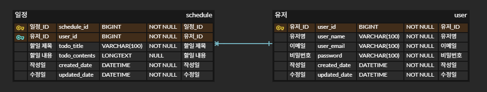

# 📅 schedule-app-dev
내일배움캠프 - 일정 관리 앱 Develop 과제

## 🐾 프로젝트 소개

schedule-app-dev은 CRUD 기반의 일정 관리 앱입니다.

기존의 schedule-app 보다 기능이 추가되며, JPA와 Cookie/Session를 활용합니다.

## 📌 주요 기능

각 레벨의 기능을 구현할 때마다 브랜치를 생성했습니다. 

`essential` :  필수과제(Lv 1 ~ Lv 4)의 기능
- `Lv 1` : 일정 CRUD
- `Lv 2` : 유저 CRUD
- `Lv 3` : 회원가입
- `Lv 4` : 로그인(인증)

## 📑 API 명세서
아래 링크를 통해, 각 Method에 대한 요구사항 및 URL, Request, Response, 상태코드를 확인할 수 있습니다.

[API 명세서 by postman](https://documenter.getpostman.com/view/44733463/2sB2qWG4BX)

## 🗂️ ERD



## ✅ 요구사항

### 1️⃣ 필수 기능 가이드

Lv 0. API 명세 및 ERD 작성
- [x] API 명세서 작성하기
- [x] ERD 작성하기
- [x] SQL 작성하기

Lv 1. 일정 CRUD
- [x] 일정을 생성, 조회, 수정, 삭제할 수 있습니다.
  - 생성 : 세션에서 유저 정보를 가져와, 생성한 일정과 연결합니다.
  - 조회 : 일정을 전체 조회와 선택 조회가 가능합니다.
  - 수정 : 본인이 작성한 일정을 수정합니다.
    - 세션에서 유저 정보를 가져와, 선택한 일정이 본인 것인지 확인합니다.
  - 삭제 : 본인이 작성한 일정을 삭제합니다.
    - 세션에서 유저 정보를 가져와, 선택한 일정이 본인 것인지 확인합니다.
 
Lv 2. 유저 CRUD / Lv 3. 회원가입
- [x] 유저를 생성, 조회, 수정, 삭제할 수 있습니다.
- [x] 유저에 비밀번호 필드를 추가합니다.
    - 생성 : 회원가입을 진행합니다.
      - 유저명과 이메일은 로그인 중복을 막기위해 유일합니다.
    - 조회 : 유저를 전체 조회와 선택 조회가 가능합니다.
    - 수정 : 본인의 비밀번호를 변경합니다.
        - 세션에서 유저 정보를 가져와, 기존의 비밀번호가 맞는지 확인합니다.
    - 삭제 : 회원탈퇴를 진행합니다.
        - 세션에서 유저 정보를 가져와, 비밀번호가 맞는지 확인합니다.
        - 유저 정보를 DB 에서 삭제한 후, 로그아웃을 진행합니다.
    - 추가 기능
      - 로그인 : 이메일과 비밀번호로 유저를 찾고, 해당 정보를 세션에 저장합니다.
      - 로그아웃 : 세션에 존재한다면 로그아웃을 진행합니다.

Lv 4. 로그인(인증)
- [x] Cookie/Session을 활용해 로그인 기능을 구현합니다.
  - LoginFilter로 회원가입, 로그인, 로그아웃을 제외한 모든 요청에 로그인 확인 로직을 진행합니다.


## 📁 프로젝트 구조

```
schedule-app/
├── src/
│   ├── main/
│   │   ├── java/
│   │   │   └── com/example/scheduleapp/
│   │   │       ├── common/
│   │   │       │   └── Const.java
│   │   │       ├── config/
│   │   │       │   └── WebConfig.java
│   │   │       ├── controller/
│   │   │       │   └── ScheduleController.java
│   │   │       │   └── UserController.java
│   │   │       ├── dto/
│   │   │       ├── entity/
│   │   │       │   └── BaseTimeEntity.java
│   │   │       │   └── Schedule.java
│   │   │       │   └── User.java
│   │   │       ├── exception/
│   │   │       ├── filter/
│   │   │       │   └── LoginFilter.java
│   │   │       ├── repository/
│   │   │       │   └── ScheduleRepository.java
│   │   │       │   └── UserRepository.java
│   │   │       ├── service/
│   │   │       │   └── ScheduleService.java
│   │   │       │   └── SessionService.java
│   │   │       │   └── UserService.java
│   │   │       └── ScheduleAppDevApplication
│   │   └── resources/
│   │       ├── application.properties
│   │       ├── static/
│   │       └── templates/
│   └── test/
│       └── java/
│           └── com/example/scheduleappdev/
├── build.gradle
├── schedule.sql
├── readme/
└── README.md
```