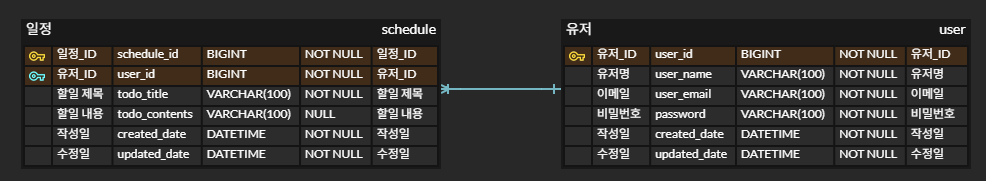

# schedule-app-dev
내일배움캠프 - 일정 관리 앱 Develop 과제

## 프로젝트 소개


## API 명세서
아래 링크를 통해, 각 Method에 대한 요구사항 및 URL, Request, Response, 상태코드를 확인할 수 있습니다.

[API 명세서 by postman](https://documenter.getpostman.com/view/44733463/2sB2qWG4BX)

## ERD



## ✅ 요구사항

### 1️⃣ 필수 기능 가이드

Lv 0. API 명세 및 ERD 작성
- [x] API 명세서 작성하기
- [x] ERD 작성하기
- [x] SQL 작성하기

Lv 1. 일정 CRUD
- [ ] 일정을 생성, 조회, 수정, 삭제할 수 있습니다.
 
Lv 2. 유저 CRUD
- [ ] 유저를 생성, 조회, 수정, 삭제할 수 있습니다.

Lv 3. 회원가입
- [ ] 유저에 비밀번호 필드를 추가합니다.

Lv 4. 로그인(인증)
- [ ] Cookie/Session을 활용해 로그인 기능을 구현합니다.


## 📁 프로젝트 구조

```
schedule-app/
├── src/
│   ├── main/
│   │   ├── java/
│   │   │   └── com/example/scheduleapp/
│   │   │       ├── controller/
│   │   │       ├── dto/
│   │   │       ├── entity/
│   │   │       ├── repository/
│   │   │       ├── service/
│   │   │       └── ScheduleAppDevApplication
│   │   └── resources/
│   │       ├── application.properties
│   │       ├── static/
│   │       └── templates/
│   └── test/
│       └── java/
│           └── com/example/scheduleappdev/
├── build.gradle
├── schedule.sql
├── readme/
└── README.md
```